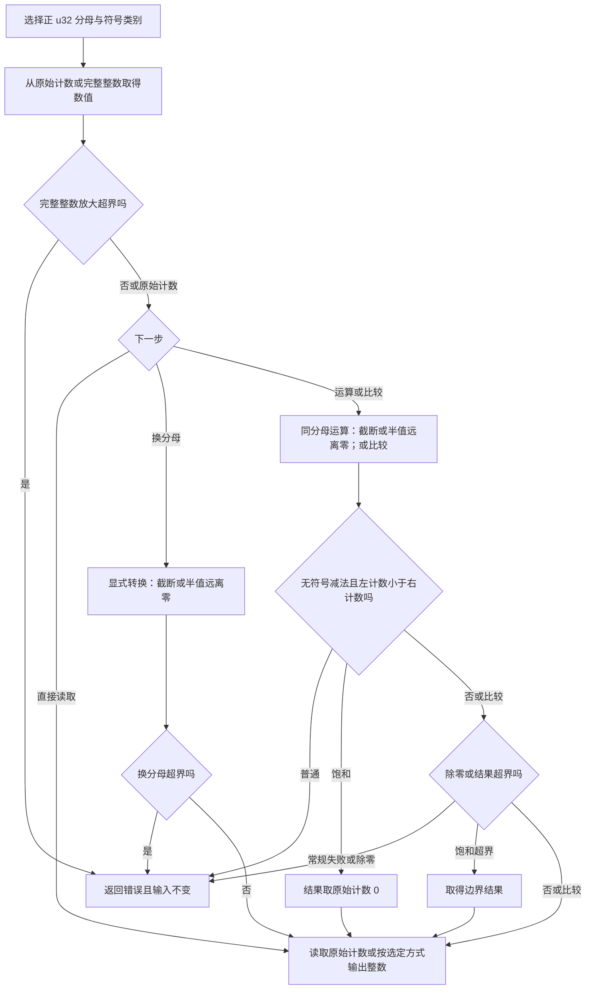

# pi-fixed-scale-int · 使用流程（L1）

```mermaid
flowchart TD
  A[选择正 u32 分母与符号类别] --> B[从原始计数或完整整数取得数值]
  B --> X{完整整数放大超界吗}
  X -->|是| G[返回错误且输入不变]
  X -->|否或原始计数| C{下一步}
  C -->|直接读取| H[读取原始计数或按选定方式输出整数]
  C -->|换分母| D[显式转换：截断或半值远离零]
  C -->|运算或比较| E[同分母运算：截断或半值远离零；或比较]
  D --> Y{换分母超界吗}
  Y -->|是| G
  Y -->|否| H
  E --> U{无符号减法且左计数小于右计数吗}
  U -->|普通| G
  U -->|饱和| Z[结果取原始计数 0]
  U -->|否或比较| F{除零或结果超界吗}
  F -->|常规失败或除零| G
  F -->|饱和超界| I[取得边界结果]
  F -->|否或比较| H
  I --> H
  Z --> H
```

源：取得数值对应固定精度和两种输入；可任选直接读取、换分母或同分母运算/比较；整数放大与换分母分别可失败；运算可选默认截断或显式半值远离零；无符号 0-1 在普通模式报 Overflow、饱和模式得到 0；常规错误、除零错误或饱和边界各有分支；输出整数也可选舍入。换分母成功后可由调用者另行发起新操作，图不强制接续运算。
